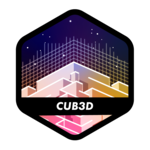

 Cub3D

A 3D game engine built with C and MiniLibX that uses raycasting to render a first-person perspective environment, inspired by classic games like Wolfenstein 3D.



## 📖 Description

Cub3D is a project that implements a raycasting engine to create a 3D graphical representation of a maze from a first-person perspective. The player can navigate through the environment with smooth movement and collision detection.

## ✨ Features

### Mandatory Features
- **3D Raycasting Engine**: Real-time 3D rendering using raycasting algorithm
- **Texture Mapping**: Wall textures based on direction (North, South, East, West)
- **Player Movement**: Smooth movement with W, A, S, D keys
- **Camera Rotation**: Look left and right with arrow keys
- **Map Parsing**: Custom `.cub` map format support
- **Color Configuration**: Customizable floor and ceiling colors
- **Collision Detection**: Prevents walking through walls

### Bonus Features
- **Minimap**: Real-time mini-map display
- **Sprites**: Animated sprite rendering
- **Mouse Controls**: Look around with mouse movement
- **Enhanced Graphics**: Additional visual effects

## 🛠 Installation

### Prerequisites
- GCC compiler
- MiniLibX library
- X11 development libraries (for Linux)
- Make

### Dependencies (Linux)
```bash
sudo apt-get update
sudo apt-get install gcc make xorg libxext-dev libbsd-dev
```

### Compilation
```bash
# Clone the repository
git clone https://github.com/BrahimJandri/cub3d.git
cd cub3d

# Compile mandatory version
make

# Compile bonus version
make bonus

# Clean object files
make clean

# Clean everything
make fclean
```

## 🎮 Usage

### Running the Game
```bash
# Run with a map file
./cub3D maps/map1/map1.cub

# Run bonus version
./cub3D_bonus maps/map1/map1.cub
```

### Controls

| Key | Action |
|-----|--------|
| `W` | Move forward |
| `S` | Move backward |
| `A` | Strafe left |
| `D` | Strafe right |
| `←` `→` | Rotate camera left/right |
| `ESC` | Exit game |

**Bonus Controls:**
- **Mouse**: Look around
- **Additional features** as implemented

## 🗺 Map Format

Maps use the `.cub` format with the following structure:

```
NO ./path/to/north_texture.xpm
SO ./path/to/south_texture.xpm
EA ./path/to/east_texture.xpm
WE ./path/to/west_texture.xpm
F 220,100,0
C 225,30,0
        1111111111111111111111111
        1000000000110000000000001
        1011000001110000000000001
        1001000000000000000000001
111111111011000001110000000000001
100000000011000001110111111111111
11110111111111011100000010001
11110111111111011101010010001
11000000110101011100000010001
10000000000000001100000010001
10000000000000001101010010001
11000001110101011111011110N0111
11110111 1110101 101111010001
11111111 1111111 111111111111
```

### Map Elements
- `1`: Wall
- `0`: Empty space
- `N`, `S`, `E`, `W`: Player starting position and orientation
- `NO`, `SO`, `EA`, `WE`: Texture paths for each wall direction
- `F`: Floor color (RGB)
- `C`: Ceiling color (RGB)

## 📁 Project Structure

```
cub3d/
├── mandatory/          # Core implementation
│   ├── Headers/        # Header files
│   ├── parsing/        # Map and config parsing
│   ├── main.c         # Entry point
│   ├── raycasting.c   # Raycasting algorithm
│   ├── render.c       # Rendering functions
│   ├── move.c         # Movement logic
│   └── ...
├── bonus/             # Bonus features
├── library/           # External libraries
│   ├── Libft/         # Custom C library
│   ├── get_next_line/ # File reading utility
│   └── minilibx/      # Graphics library
├── maps/              # Game maps
├── Textures/          # Wall textures
├── Makefile          # Build configuration
└── README.md         # This file
```

## 🎯 Technical Details

- **Language**: C
- **Graphics**: MiniLibX
- **Resolution**: 880x620 pixels
- **Compilation Flags**: `-Wall -Wextra -Werror`
- **Rendering**: Raycasting algorithm for 3D projection
- **Textures**: XPM format support

## 👤 Author

**Brahim Jandri** - [@BrahimJandri](https://github.com/BrahimJandri)

## 📝 License

This project is part of the 42 School curriculum.

---

*Enjoy exploring the 3D world of Cub3D! 🎮*
